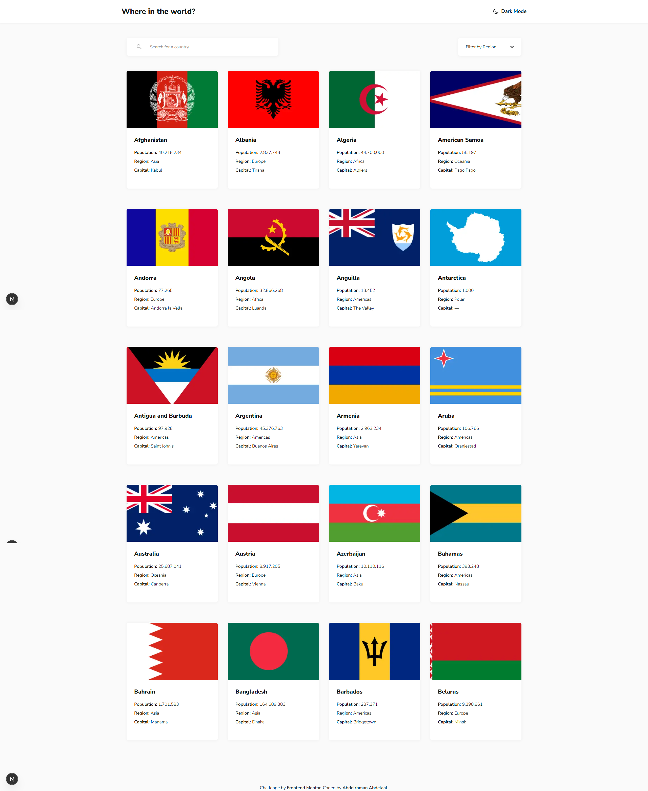

# Frontend Mentor - REST Countries API with color theme switcher solution

This is a solution to the [REST Countries API with color theme switcher challenge on Frontend Mentor](https://www.frontendmentor.io/challenges/rest-countries-api-with-color-theme-switcher-5cacc469fec04111f7b848ca). Frontend Mentor challenges help you improve your coding skills by building realistic projects.

## Table of contents

- [Overview](#overview)
  - [Screenshot](#screenshot)
  - [Links](#links)
- [My process](#my-process)
  - [Built with](#built-with)
  - [What I learned](#what-i-learned)
- [Author](#author)

## Overview

### Screenshot

### Links

- Solution URL: [GitHub](https://github.com/MrBlackvanta/rest-countries-api-with-color-theme-switcher)
- Live Site URL: [Cloudflare](https://rest-countries-api-with-color-theme-switcher.abdelrhman-ahmed8881.workers.dev)
- Mirror: [Netlify](https://vanta-rest-countries-api-with-theme.netlify.app)
- API: [Render](https://vanta-rest-countries-api.onrender.com/countries) ([health](https://vanta-rest-countries-api.onrender.com/health))

## My process

### Built with

- [Next.js 16](https://nextjs.org/)
- [React 19](https://react.dev/)
- TypeScript
- [Tailwind CSS v4](https://tailwindcss.com/)
- [next-themes](https://github.com/pacocoursey/next-themes)
- A self-built .NET REST API serving paginated, filterable country data (in place of the suggested restcountries.com)
- Deployed as a Cloudflare Worker through [OpenNext](https://opennext.js.org/cloudflare), with the .NET API in a container on Render

### What I learned

**`priority` on `<Image>` is for exactly one image — and on a single-column mobile grid, that's the first card.** I started with `priority` on the first four country cards, assuming "above the fold on desktop" was the rule. The mechanism is what makes that wrong: `priority` injects a `<link rel="preload" as="image" fetchpriority="high">` into the document head. On mobile the grid is one column, so only card 0 is the LCP candidate — preloading cards 1–3 fires three more high-priority requests that compete with the real LCP image for bandwidth on a throttled connection, _delaying_ the thing the metric measures. `priority` goes on the LCP candidate and nothing else: `priority={index === 0}`.

**`useSearchParams()` forces a Suspense boundary — and on this page nothing needed to read the URL twice.** The filter bar used to pull `name` and `region` out of the URL with `useSearchParams()`, which drags a request-time dependency into the client and bails the _entire_ route out of static/server rendering unless it's wrapped in `<Suspense>`. But the page is a Server Component that already `await`s `searchParams` to fetch the data, so the values are sitting right there. Passing them down as props deletes the hook, the boundary, and the second source of truth in one move — the URL stays the only state, and the server stays the only thing that reads it.

**A filter change is a fetch, and React deliberately refuses to tell you it's happening.** Picking a region calls `router.replace`, which re-runs the Server Component. Next performs that inside a transition, and a transition's entire job is to keep the _old_ UI on screen rather than flash a fallback — so `loading.tsx` never appears and the page simply sits there for a beat with no dropdown label change, no spinner, nothing. The pending state has to be asked for: driving the navigation with `startTransition` from `useTransition` surfaces `isPending`, which dims the grid behind `aria-busy` and spins the dropdown. `useOptimistic` covers the other half — the label reads "Europe" on click instead of one round-trip later, because the optimistic value is held for exactly as long as the transition is pending, which is exactly as long as the real value would have lagged.

**The client router cache keeps dynamic pages for zero seconds by default.** Both routes here are dynamically rendered, and since v15 the `dynamic` entry of the Client Router Cache defaults to `0` — nothing is reused, so re-picking a region or reopening a country you were just looking at pays the whole RSC round-trip again. `experimental.staleTimes: { dynamic: 300 }` gives those entries a five-minute life, and since the cache key includes the search string, `/?region=Europe` and `/?region=Africa` are separate entries rather than one entry that clobbers itself. This is the part people install TanStack Query for; the App Router already has it, it just ships switched off. `experimental.dynamicOnHover` then covers the _first_ click, prefetching a country's full dynamic payload on hover instead of only its loading boundary — paid for with one server render per hovered card, which is a fair trade against the alternative (`generateStaticParams` over ~250 countries) coupling every Netlify build to the API being awake.

**A changing `key` is the cleanest way to reset accumulated state.** `CountryGrid` accumulates pages as you scroll. When the search or region filter changes, all of that has to reset to page one. Instead of a `useEffect` that watches the props and resets several `useState`s, the page passes `key={`${name}|${region}`}`. The key changes, React unmounts and remounts the grid, and its initial state simply _is_ the new first page. The remount is the reset — no syncing logic to keep correct.

**A Server Action can be a typed data endpoint, not just a form handler.** Infinite scroll needs the client to request page N+1. Rather than stand up a route handler and re-type the response on the client, `loadMoreCountries` is a `"use server"` function that wraps the same `getCountries` the server components already use. The client component imports it and `await`s it like a local async function — fully typed end to end, one data layer feeding both the server render and client-side pagination.

**The custom region dropdown tracks selection with `aria-activedescendant`, not roving `tabindex`.** A native `<select>` couldn't be styled to the design, so the filter is a `<button>` plus a `<ul role="listbox">`. The instinct is to move `tabIndex` between options as the user arrows through them. The listbox pattern from the ARIA APG is simpler: real DOM focus stays on the `<ul>`, and a _virtual_ cursor moves by pointing `aria-activedescendant` at the active option's `id`. Arrow keys update one state value, no element's `tabIndex` ever changes, and all keyboard handling lives in a single `onKeyDown`.

**The theme toggle's animation is a progressive enhancement, not a dependency.** Switching themes flips a class on `<html>` — that part works everywhere. The circular wipe that expands from the click point is layered on top with the View Transitions API: it's feature-detected (`"startViewTransition" in document`, falling back to an instant switch) and the keyframes are disabled under `prefers-reduced-motion`. Browsers that can't do it still switch themes instantly; the animation is a bonus for the ones that can.

## Author

- UpWork - [Abdelrhman Abdelaal](https://upwork.com/freelancers/~01f0a9479696b61f49)
- Frontend Mentor - [@MrBlackvanta](https://www.frontendmentor.io/profile/MrBlackvanta)
- LinkedIn - [Abdelrhman Abdelaal](https://www.linkedin.com/in/abdelrhman-vanta/)
