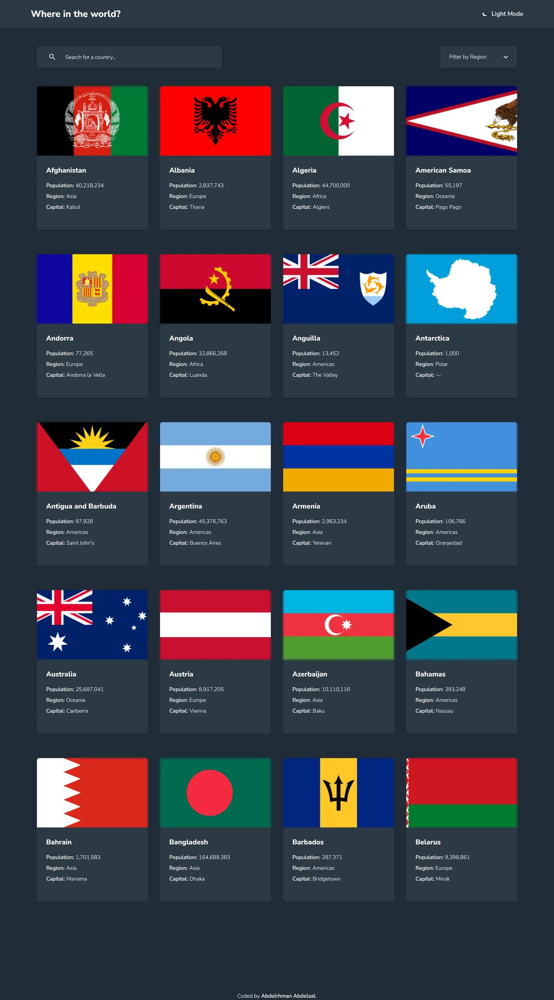

# REST Countries API with theme switcher

My solution to the [REST Countries API with color theme switcher](https://www.frontendmentor.io/challenges/rest-countries-api-with-color-theme-switcher-5cacc469fec04111f7b848ca)
challenge on Frontend Mentor.

Instead of calling restcountries.com I wrote my own .NET API behind it, which serves
paginated and filterable country data. It runs in a container on Render; the frontend is a
Cloudflare Worker via OpenNext.

- Live: https://rest-countries-api-with-color-theme-switcher.abdelrhman-ahmed8881.workers.dev
- Code: https://github.com/MrBlackvanta/rest-countries-api-with-color-theme-switcher

## Built with

- Next.js
- React
- TypeScript
- Tailwind CSS
- A .NET API for the data (see `backend/`)

## Author

- [LinkedIn](https://www.linkedin.com/in/abdelrhman-vanta/)
- [UpWork](https://www.upwork.com/freelancers/mrblackvanta)
- [Frontend Mentor](https://www.frontendmentor.io/profile/MrBlackvanta)
